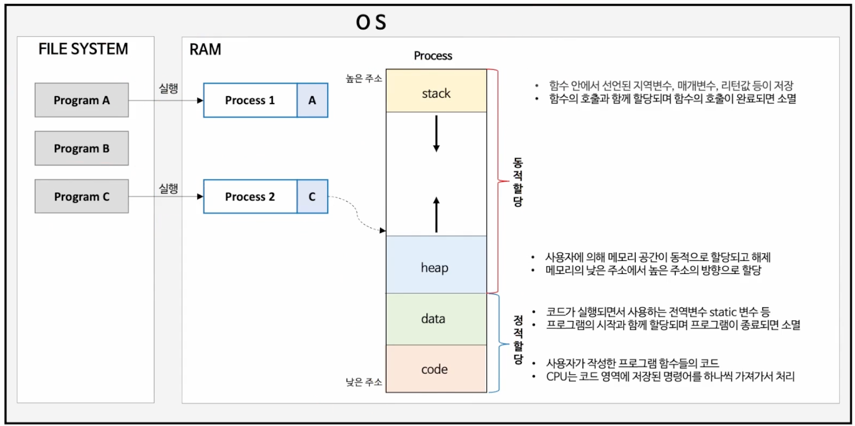
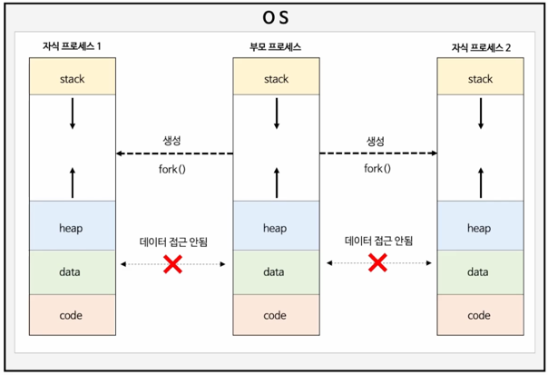
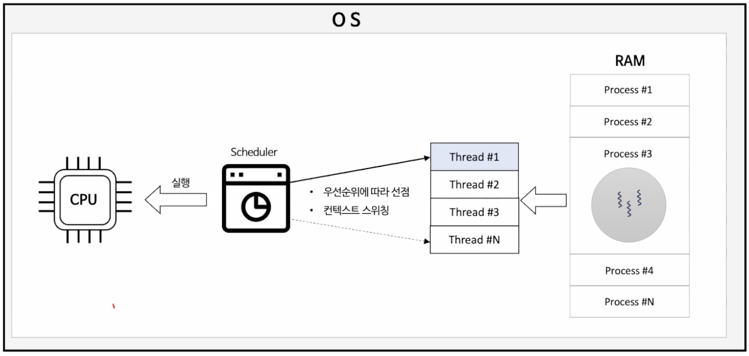

### Process
- 운영체제에 의해 파일 시스템에 설치되어 있는 파일을 프로그램이라 한다.
- 프로세스는 프로그램의 실제 `실행` 을 의미하며, 프로그램 파일을 실행함으로써 프로그램 데이터들이 메모리에 올라와 `CPU 를 할당받고 명령을 수행하고 있는 상태이다` <- 근데 이게 크게 보면 맞긴해. 정확히는 Thread 가 우리가 짜놓은 코드를 실행시키는 주체야
- `프로세스는 운영체제로부터 자원을 할당받은 최소 작업 단위` 이다.
  - `실행중인 프로그램` 이 프로세스다.
  

### 구성도

### Process
- 운영체제는 프로세스마다 각각 독립된 메모리 영역을 Code/ Data/ Stack / Heap 의 형식으로 할당해준다.
- 독립된 메모리 영역을 할당해 주기 때문에 프로세스 간 영향을 받지 않고 독립적인 작업을 수행할 수 있다.
- 기본적으로 다른 프로세스의 변수나 자료에 접근할 수 없고 IPC 나, 공유 메모리 등의 통신 기법들을 사용해서 프로세스 간 통신해야한다.

> IPC는 "Inter-Process Communication"의 약자로, 프로세스 간 통신을 의미  
> 운영체제는 프로세스마다 독립된 메모리 공간을 할당하기 때문에 기본적으로 한 프로세스가 다른 프로세스의 메모리 공간에 직접 접근할 수 없ek.  
> 따라서 프로세스 간에 데이터를 주고받기 위해서는 IPC 기법을 사용해야 한다  

### Thread
- 쓰레드는 프로세스가 운영체제로부터 할당 받은 자원을 이용하는 실행단위 또는 흐름의 단위로써, 하나의 프로세스는 반드시 하나 이상의 스레드를 갖늦다
- 프로세스 내에서 각 필요한 Stack 만 할당받고 Code, Data, heap 영역은 공유해서 각 스레드가 공유한다.
- 스레드 간 메모리 스택 영역에 접근 할 수 없으므로 스레드는 독립적인 실행 흐름을 가질 수  있게되어 독립적인 함수 호출이 가능해 진다.

> 우리가 짠 코드를 실행하는 주체는 프로세스 가 가지고 있는 Thread 야.   
> java 의 main 메서드 실행하면 main Thread 가 생성이됨.  
> 중요한 내용은 이제부터인데, 프로세스는 자식 프로세스를 fork 를 떠서 생성하고 stack, heap, data, code 영역이 독립적이다.  
> 반면, Thread 는 프로세스 내에서 독깁적인 고유한 Stack 영역 을 할당 받고, code, data, heap 영역도 생성되지만, stack 을 제외한 나머지 영역인 code, data, heap 은 쓰레드간에 서로 공유가 가능하다  
> 그래서 Thread Safe 하지 않다 라는 말이 나오는건 얘네들이 서로 공유해서 그런것이다. ( 동시성 문제 )  

### Thread & CPU 
- 쓰레드는 운영체제의 스케줄러에 의해 관리되는 CPU 의 최소 실행 단위를 의미한다.
- 스케줄러의 알고리즘에 따라 프로세스에 속한 한개의 스레드가 선점되어 CPU 에 할당된다.
- 쓰레드 간 선점이 일어날 때 CPU 의 실행 흐름 (문맥)이 전환되는 컨텍스트 스위칭이 발생한다.

### Process 와 Thread 정리
- Process
  - 여러개의 자식 프로세스중 하나에 문제가 발생하면, 자식 프로세스만 죽고, 다른 프로세스에게 영향을 미치지 않는다. 즉 프로그램의 전체에 안정성을 확보할 수 있다.
  - 프로세스 간 전환(컨텍스트 스위칭) 시 레지스터, 캐시 메모리 초기화 등 무거운 작업으로 인한 시간적인 비용이 많이 발생한다.
  - 프로세스 간 통신 기법이 어렵고 복잡해서 통신으로 인한 오버헤드가 크다.
  - 프로세스 생성 시 독립적으로 메모리가 할당되기 때문에 리소스 비용이 크다.
- Thread 
  - 여러 개의 스레드 중 하나에 문제가 발생하면 전체 프로세스에 영향을 미치게 된다.
  - 프로세스의 메모리 영역을 공유 하기 때문에 컨텍스트 스위칭 시간이 적고 리소스를 효율적으로 사용한다.
  - 스레드 간 통신비용이 적어 통신으로 인한 오버헤드가 작다.
  - 스레드 간 공유 메모리 영역의 동시 접근으로 인한 동기화 문제가 발생한다.
  - 하나의 스레드에서 오류가 발생할 경우 프로세스 자체가 종료될 수 있다.

