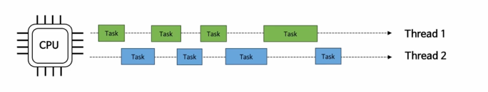
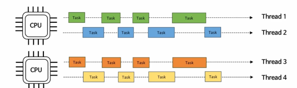
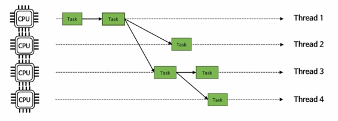

### 개요
- 동시성은 특정한 순서 없이 `겹치는 기간에 시작, 실행 및 완료` 되는 여러 작업에 관한 것을 의미한다
- 병렬성은 멀티 코어 프로세서에서 동시에 실행되는 동일한 작업의 여러 작업에 관한 것
- 동시성과 병렬성은 비슷한 부분은 있지만 동일하지 않다

### 동시성

- 동시성은 CPU 가 한번에 많은 일을 처리하는 것에 중점을 둔다. 즉 많은 작업들을 아주 빠른 시간으로 교체하면서 전체 작업을 처리한다.
- 동시성은 작업의 처리를 빠르게 하기 위한 목적이 아닌 CPU 를 효율적으로 사용하는 것에 더 중점을 둔다.
  - 쓰레드가 작업을 처리하다 IO 블록에 걸렸을 경우 CPU 는 다른 스레드로 전환해서 작업을 진행
- 동시성은 작업에 대한 처리 방식을 어떤 식으로 진행할 것인가에 대한 설계적 관점에서 이해해야한다.
- 동시성은 작업해야 할 수가 CPU 코어 수 보다 많을 경우 해당되며 동시성이 없으면 작업을 순차적으로 진행해야 한다.

### 병렬성
- 병렬성은 CPU 가 동시에 많은 일을 수행하는 것에 중점을 둔다. 즉 CPU 가 놀지 않고 최대한 바쁘게 동작해야 한다
- 병렬성은 런타임에 동시에 물리적으로 작업을 실행하는 것이며 여러 컴퓨팅 리소스가 있는 하드웨어가 필요하다. 한 개의 코어에서는 절대 병렬성이 구현될 수 없다
- 병렬성은 동시성의 하위 개념으로 작업을 여러 Thread로 분리하고, 운영체제는 그 Thread를 여러 CPU에 적절히 분배하여 동시적으로 실행되도록 하는 것이다 
- 동시성이 작업 처리 방식에 대한 설계에 관한 것이라면 병렬성은 하드웨어에서 계층에서 작업 수행 방식에 관한 것이다. 
- 병렬성은 작업해야 할 수가 CPU 코어 수 보다 같거나 적을 경우 가장 효율성이 좋다.

### 병렬성과 동시성 조합

### Parallelism - Divide and Conquer ( 분할 정복 )
